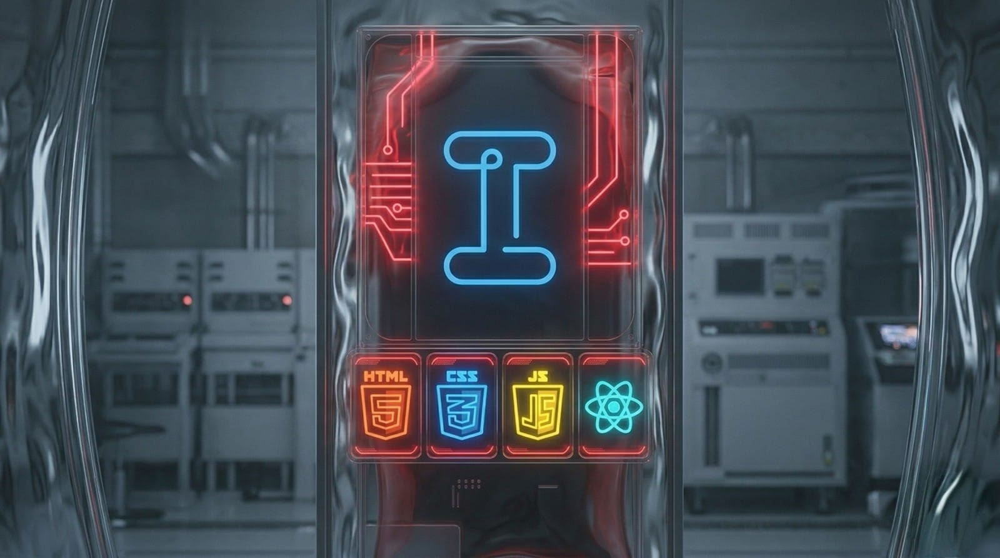

# 🚀 Ismael Fernandes | Portfólio Full-Stack & UI/UX

  

> **"Unindo a precisão do desenvolvimento de sistemas à sensibilidade do design para criar experiências digitais memoráveis."**

Este é o meu portfólio profissional, desenvolvido para centralizar meus projetos, formações técnicas e experiências como desenvolvedor. O projeto foca em **performance**, **responsividade extrema** e **acessibilidade**.

## 🎨 O Projeto

O portfólio foi construído com uma arquitetura modular, permitindo a troca dinâmica de temas (Light/Dark Mode) e uma navegação fluida entre seções.

### ✨ Funcionalidades Principais:
* **Toggle Theme:** Sistema inteligente de troca de tema com persistência via `localStorage`.
* **Acordeão Exclusivo:** Seção de cursos com lógica JavaScript para fechamento automático de itens adjacentes, otimizando o foco do usuário.
* **UI Minimalista:** Design focado no conteúdo, com efeitos de *glassmorphism* e micro-interações em botões (Hover effects).
* **SEO & Performance:** Tags meta otimizadas e carregamento de ativos estruturado para melhor indexação.

## 🛠️ Tecnologias Utilizadas

### Front-end & Design
* **HTML5 / CSS3:** Estrutura semântica e estilização avançada com Variáveis CSS.
* **JavaScript (ES6+):** Manipulação de DOM, lógica de acordeão e sistema de temas.
* **Bootstrap Icons:** Biblioteca de ícones vetoriais para interface.
* **Figma / UX Principles:** Base de design focada em Personas e Golden Path.

### Infraestrutura & Ferramentas
* **Git / GitHub:** Controle de versionamento e deploy.
* **Vercel / GitHub Pages:** Hospedagem de alta performance.

## 🎓 Destaques Acadêmicos (ADS)

No coração deste portfólio, destaco minha jornada em **Análise e Desenvolvimento de Sistemas**, incluindo certificações de peso:
* **Oracle Next Education (ONE):** Foco em Java, Spring e Inteligência Artificial.
* **Cisco Networking Academy:** Especialização em Redes e Python Essentials.
* **EBAC:** Imersão em UX Design e resolução de cases reais.

## 📧 Contato & Conexões

Sinta-se à vontade para explorar meus repositórios ou entrar em contato para novas oportunidades!

---

Desenvolvido com ☕ e muito código por Ismael Fernandes.

